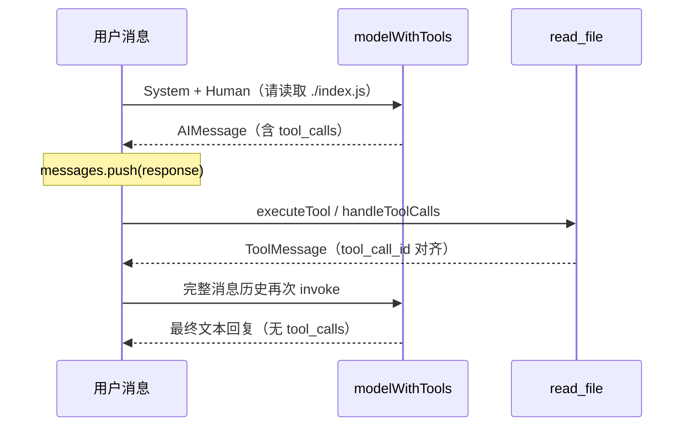

# 02-tools-file_read

进阶示例：在 LangChain.js 中定义 `read_file` 工具，绑定到模型，并实现完整的 **Tool Call Loop**（模型请求工具 → 本地执行 → 回传结果 → 继续推理）。

前置步骤见 [`../01-tools-test`](../01-tools-test)（仅验证模型连通）。更细的坑点与排查笔记见 [`docs/langchain-tool-calls-notes.md`](./docs/langchain-tool-calls-notes.md)。

## 你会学到什么

- 用 `tool()` + Zod Schema 定义结构化工具
- 用 `bindTools()` 把工具暴露给模型
- 维护消息链路：`SystemMessage` / `HumanMessage` / AI 响应 / `ToolMessage`
- 实现工具调用循环，避免常见的 `tool_call_id not found` 400 错误

## 技术栈

| 依赖 | 用途 |
| --- | --- |
| `@langchain/openai` | `ChatOpenAI` 客户端（兼容 OpenAI 协议） |
| `@langchain/core` | `tool()`、消息类型（`HumanMessage` / `SystemMessage` / `ToolMessage`） |
| `zod` | 工具入参 Schema |
| `dotenv` | 加载 `.env` |
| Node.js（ES Module） | `fs` / `path` 读取本地文件 |

本示例通过智谱 AI 的 OpenAI 兼容接口接入（默认模型 `glm-4.6`）。

## 环境变量

```bash
cp .env.example .env
```

| 变量 | 必填 | 默认值 | 说明 |
| --- | --- | --- | --- |
| `ZHIPU_API_KEY` | 是 | — | 智谱开放平台 API Key |
| `ZHIPU_MODEL_NAME` | 否 | `glm-4.6` | 模型名称 |
| `ZHIPU_BASE_URL` | 否 | `https://open.bigmodel.cn/api/paas/v4` | OpenAI 兼容接口地址 |

## 快速开始

```bash
npm install
npm start
```

默认会让模型读取并解释当前目录的 `./index.js`。终端中可以看到工具执行日志，以及最终文本回复。

语法检查（不发起真实请求）：

```bash
npm test
```

## 运行流程



核心循环（见 [`index.js`](./index.js)）：

```js
let response = await modelWithTools.invoke(messages)

while (hasToolCalls(response)) {
  messages.push(response) // 先保留带 tool_calls 的 AI 消息
  await handleToolCalls(response.tool_calls, messages) // 再追加 ToolMessage
  response = await modelWithTools.invoke(messages)
}

console.log(response.content)
```

**顺序很重要**：必须先把含 `tool_calls` 的 AI 响应写入 `messages`，再追加对应的 `ToolMessage`。漏掉前一步，服务端常会报 `tool result's tool id ... not found`。

## 代码概览

入口在 [`index.js`](./index.js)：

1. **初始化模型**：读取 `ZHIPU_*`，创建 `ChatOpenAI`（`temperature: 0`）
2. **定义工具**：`read_file` 解析路径、校验为文件、读取 UTF-8 内容
3. **绑定工具**：`model.bindTools(tools)` 得到 `modelWithTools`
4. **构造对话**：System 提示工作流 + Human 提出读文件请求
5. **工具循环**：`hasToolCalls` → `handleToolCalls`（可并行执行）→ 再次 `invoke`
6. **输出最终回复**：循环结束且无 `tool_calls` 时打印 `response.content`

工具定义形态：

```js
const readFileTool = tool(
  async ({ filePath }) => {
    // 读文件并返回内容字符串
  },
  {
    name: "read_file",
    description: "用此工具来读取文件内容。...",
    schema: z.object({
      filePath: z.string().describe("要读取的文件路径"),
    }),
  },
)
```

## 辅助函数

| 函数 | 作用 |
| --- | --- |
| `executeTool(toolCall)` | 按名称匹配工具并 `invoke`；匹配失败或执行异常时返回错误字符串（不中断循环） |
| `hasToolCalls(response)` | 判断响应是否仍包含 `tool_calls` |
| `handleToolCalls(toolCalls, messages)` | 并行执行全部工具调用，并按 `tool_call_id` 追加 `ToolMessage` |

## 相关文档

- 详细笔记（`tool()` 两参数、`bindTools`、400 排查）：[`docs/langchain-tool-calls-notes.md`](./docs/langchain-tool-calls-notes.md)
- 上一步最小连通示例：[`../01-tools-test`](../01-tools-test)
